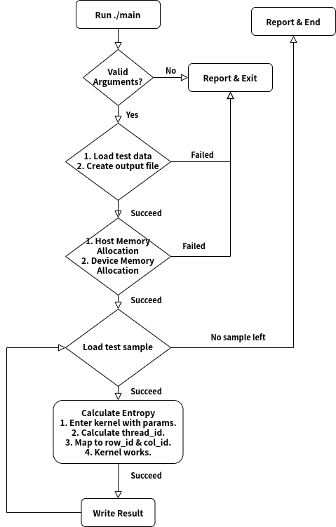
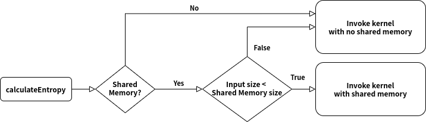

## Report - CUDA: Entropy Calculation in 2-d Matrix (HW1)

> 17341137 - 宋震鹏 HW1

[toc]

### 1 Abstract

This report is mainly made of following sections:

* Experiment environment
* Overall logic
* Questions shooting
* CUDA vs. OpenMP

---

<div STYLE="page-break-after: always;"></div>

### 2 Environment

#### 2.1 System info

| OS        | **Ubuntu 18.04.4 LTS**                        |
| --------- | --------------------------------------------- |
| **CPU**   | **Intel(R) Core(TM) i7-7700HQ CPU @ 2.80GHz** |
| **GPU**   | **GeForce GTX 1050**                          |
| **CUDA**  | **CUDA Version 10.2.89**                      |
| **cuDNN** | **cuDNN Version 7.6.5**                       |

#### 2.2 DevTools

* Vscode + cmake + make
* gcc/g++ 4.8 / 7
* cmake 3.10

---

 [Back To Top](##Report - CUDA: Entropy Calculation in 2-d Matrix (HW1))

<div STYLE="page-break-after: always;"></div>

### 3 Overall Logic

#### 3.1 FlowChart



<div STYLE="page-break-after: always;"></div>

`main.cpp` is coded with the logic above:

For better experience, [click here](src/main.cu).

```cpp
/*#########################################
##  @Function: main
##  @Description: main function
##=========================================
##  @Parameters:
##  - argc: number of arguments passed.
##  - argv: list of arguments passed.
#########################################*/
int main(int argc, char const* argv[])
{
    /* 
     * Check if cmd arguments are valid.
     * Note:
     *   1. Usage: ./main [shared memory(0/1)] [cached log(0/1)] [verbose(0/1)]
     *   2. 0 is always for false/off, 1 is always for true/on.
     *   3. arguments are read in one-by-one, default value only work for 
     *      arguments at the back.
     */
    if (argc > 4) {
        printf("Invalid Usages.\n");
        printf("Usage: ./main [shared memory(0/1)] [cached log(0/1)] [verbose(0/1)]\n");
        exit(-1);
    }
    const int printSample = argc == 4 ? atoi(argv[3]) : 1;
    const int printResult = argc == 4 ? atoi(argv[3]) : 1;
    const int SHARED_MEM = argc > 1 ? atoi(argv[1]) : 0;
    const int CACHED_LOG = argc > 2 ? atoi(argv[2]) : 0;

    // Open the data file
    FILE* instream = fopen(dataPath.c_str(), "rb");
    if (instream == NULL) {
        printf("failed to open the data file\n");
        return -1;
    }

    // Open a stream to write out results in text
    FILE* outStream = fopen(outputPath.c_str(), "w");
    if (outStream == NULL) {
        printf("failed to open the output file\n");
        return -1;
    }

    // Initialize variables
    int ROWS, COLS;
    long t1, t2;
    double time_in_total = 0.0;

    /*
     * VAR_h : host variable.
     * VAR_d : device variable.
     */
    float* input_h;
    float* input_d;
    float* output_h;
    float* output_d;
    float* logres_h;
    float* logres_d;

    // Cached log result
    logres_h = (float*)malloc(26 * sizeof(float));
    for (int i = 1; i <= 25; i++) {
        logres_h[i] = log(i);
    }

    // Memory allocation
    CHECK(cudaMalloc((void**)(&logres_d), 26 * sizeof(float)));
    // Memory Copy : Host to Device
    CHECK(cudaMemcpy((void*)(logres_d), (void*)(logres_h), 26 * sizeof(float), cudaMemcpyHostToDevice));

    // Read in and process the samples one-by-one
    while (getNextSample(instream, &COLS, &ROWS, &input_h) != 0) {

        output_h = (float*)malloc(ROWS * COLS * sizeof(float));

        // Verbose
        if (printSample) {
            // Print out a small portion of the sample
            printf("\nsample: [%d x %d]\n", ROWS, COLS);
            for (int j = ROWS - 5; j < ROWS; j++) {
                for (int i = COLS - 5; i < COLS; i++) {
                    printf("%8.5f ", input_h[j * COLS + i]);
                }
                printf("\n");
            }
        }


        // Memory allocation
        CHECK(cudaMalloc((void**)(&input_d), ROWS * COLS * sizeof(int)));
        CHECK(cudaMalloc((void**)(&output_d), ROWS * COLS * sizeof(float)));

        // Memory Copy : Host to Device
        CHECK(cudaMemcpy((void*)(input_d), (void*)(input_h), ROWS * COLS * sizeof(int), cudaMemcpyHostToDevice));
        CHECK(cudaMemcpy((void*)(output_d), (void*)(output_h), ROWS * COLS * sizeof(float), cudaMemcpyHostToDevice));

        // Time record
        t1 = getTime();
        
        // Call kernel
        calculateEntropy(input_d, output_d, logres_d, ROWS, COLS, SHARED_MEM, CACHED_LOG);

        // Time record
        t2 = getTime();

        // Memory Copy : Device to Host
        CHECK(cudaMemcpy((void*)(input_h), (void*)(input_d), ROWS * COLS * sizeof(int), cudaMemcpyDeviceToHost));
        CHECK(cudaMemcpy((void*)(output_h), (void*)(output_d), ROWS * COLS * sizeof(float), cudaMemcpyDeviceToHost));

        // Verbose
        if (printResult) {
            // Print out a small portion of the result
            printf("result:\n");
            for (int j = ROWS - 5; j < ROWS; j++) {
                for (int i = COLS - 5; i < COLS; i++) {
                    printf("%8.5f ", output_h[j * COLS + i]);
                }
                printf("\n");
            }
        }

        // Report - sample
        time_in_total += double(t2 - t1) / 1000000000L;
        printf("Calculation is done in %f second(s).\n", double(t2 - t1) / 1000000000L);


        // Write the result to the output stream
        char buffer[128];
        sprintf(buffer, "%d,", COLS);
        W_CHK(fputs(buffer, outStream));
        sprintf(buffer, "%d,", ROWS);
        W_CHK(fputs(buffer, outStream));
        for (int i = 0; i < ROWS * COLS; i++) {
            sprintf(buffer, "%.5f,", output_h[i]);
            W_CHK(fputs(buffer, outStream));
        }
        W_CHK(fputs("\n", outStream));


        // De-allocate the sample and the result
        cudaFree((void*)input_d);
        cudaFree((void*)output_d);

        free(input_h);
        free(output_h);
        input_h = NULL;
        output_h = NULL;
    }

    // Report - ALL
    printf("\n>>> Samples were all done in %f second(s).\n", time_in_total);
    printf(">>> Shared Memory: %s\n", SHARED_MEM ? "ON" : "OFF");
    printf(">>> Cached Log(0~25): %s\n", CACHED_LOG ? "ON" : "OFF");

    cudaFree((void*)logres_d);
    free(logres_h);
    logres_d = NULL;
    logres_h = NULL;


    // Close the output stream
    fclose(instream);
    fclose(outStream);
    return 0;
}
```

What actually the cuda kernel does will be discussed later.

<div STYLE="page-break-after: always;"></div>

#### 3.2 Kernel

For better experience, [click here](src/cuda/cuda_2dEntropy.cu).

##### 3.2.1 Kernel Controller

This function act as a controller to invoke kernel function after processing user parameters.



<div STYLE="page-break-after: always;"></div>

```cpp
/*#########################################
##  @Function: calculateEntropy
##  @Description: Control and invoke the
##    kernel function.
##=========================================
##  @Parameters:
##  - input: input matrix, in 1d version.
##    *Note:
##      use 1d array to store 2d data, 
##      2d[i][j] = 1d[i*cols + j].
##  - output: output matrix, in 1d version,
##            each element records entropy
##            of  the  sub-area  which  is
##            centered  with  it, overflow 
##            is ignored.
##  - logres: cached result of log(1) to 
##            log(25).
##  - rows: number of rows in input.
##  - cols: number of columns in input.
##  - SHARED_MEM: Flag to set whether to
##                use shared memory.
##  - CACHED_LOG: Flag to set whether to
##                use cached log result.
#########################################*/
void calculateEntropy(float* input, float* output, float* logres, int rows, int cols, bool SHARED_MEM, bool CACHED_LOG)
{
    // In case of some not divisible(by blockdim.x) input size,
    // an addtional block is dispatched for completeness.
    int block_size = (rows * cols) % 1024 ? (rows * cols) / 1024 + 1: (rows * cols) / 1024;

    // Not using shared memory
    if (!SHARED_MEM) {
        calculateSubEntropy<<<block_size, 1024>>>(input, output, logres, rows, cols, CACHED_LOG);
    }
    // Failed in using shared memory, 
    // since shared memory is limited to a small value.
    else if (SHARED_MEM && (rows * cols) * sizeof(float) > 49152) {
        printf("\nAllocating size overflow, allocating %d bytes > shared memory size %d bytes\n", int((rows * cols) * sizeof(float)), 49152);
        printf("Use Non-shared-memory mode instead.\n\n");
        calculateSubEntropy<<<block_size, 1024>>>(input, output, logres, rows, cols, CACHED_LOG);
    }
    // Using shared memory
    else if (SHARED_MEM && (rows * cols) * sizeof(float) <= 49152) {
        const size_t shared_mem_size = (rows * cols) * sizeof(float);
        calculateSubEntropy_sharedMem<<<block_size, 1024, shared_mem_size>>>(input, output, logres, rows, cols, CACHED_LOG);
    }
    // Synchronization
    CHECK(cudaDeviceSynchronize());
}

```

<div STYLE="page-break-after: always;"></div>

##### 3.2.1 Shared Memory - OFF

```cpp
/*#########################################
##  @Function: calculateSubEntropy
##  @Description: calculate a sub-area of 
##    input matrix, size of  sub-area  is 
##    (WINDOW_SIZE x WINDOW_SIZE) defined
##    in header  file,  not  using shared
##    memory.
##=========================================
##  @Parameters:
##  - input: input matrix, in 1d version.
##    *Note:
##      use 1d array to store 2d data, 
##      2d[i][j] = 1d[i*cols + j].
##  - output: output matrix, in 1d version,
##            each element records entropy
##            of  the  sub-area  which  is
##            centered  with  it, overflow 
##            is ignored.
##  - logres: cached result of log(1) to 
##            log(25).
##  - rows: number of rows in input.
##  - cols: number of columns in input.
##  - CACHED_LOG: Flag to set whether to
##                use cached log result.
#########################################*/
__global__ void calculateSubEntropy(float* input, float* output, float* logres, int rows, int cols, bool CACHED_LOG)
{
    /* tid : thread id, note that:
     * ====================================================
     * |  blockDim's shape:  |  normal 2d-array's shape:  |
     * |         x           |             y              |
     * |      ------>        |          ------>           |
     * |      |              |          |                 |
     * |    y |              |        x |                 |
     * |      v              |          v                 |
     * ====================================================
     * 
     * Suppose that:
     * - input : SIZE = rows * cols
     * - A block's shape is set as: (blockDim.x, 1, 1)
     * - SIZE is distributed into K blocks.
     * 
     * The Distribution could be displayed as below:
     *
     *   input              input(SIZE)
     *                   /       |      \
     *                  /        |       \
     *   blocks        1        ...       K
     *               / | \              / | \
     *   threads    1 ... blockDim.x   1 ... blockDim.x
     * 
     * So, we know that:
     * - blockDim.x : a certain value, 
     *                in this case is set to 1024.
     * - blockIdx.x : range from 1 to K 
     *                (actually is 0 to K-1).
     * - threadIdx.x : range from 1 to blockDim.x
     *                 (actually is 0 to blockDim.x-1).
     * 
     * That's why tid = = blockDim.x * blockIdx.x + threadIdx.x.
     */
    int tid = blockDim.x * blockIdx.x + threadIdx.x;

    // Now, the element at coord.(row_id, col_id) is the centeral
    // element of the sub-area, which is going to be processed by
    // current thread.
    int row_id = tid / cols;
    int col_id = tid % cols;

    // subarr[i](i from 0 to MAX_ELEM) records 
    // how many i(s) are there in the sub-area.
    int subarr[MAX_ELEM + 1] = {0};

    double res = 0.0;

    // In case of some not divisible(by blockdim.x) input size,
    // an addtional block is dispatched for completeness, this
    // if() is used to check if coord.(row_id, col_id) is valid.
    if (row_id < rows && col_id < cols) {

        // bias determine how many elements should be taken into
        // account, around coord.(row_id, col_id) both vertically
        // and horizontally.
        int bias = WINDOW_SIZE / 2;
        /*
         * Here's two examples to show how a sub-area is selected:
         * 
         *   1. No Overflow              2. Overflowed
         *              
         *   x . x x x x x x . x         x x .  x x x x x
         *   . . .  u p . .  . .         x 1 .  2 3 4 5   
         *   . .-------------. .         . . .  . u p . . 
         *   x  | 1 2 3 4 5 |r x         . . .-----------r
         *   x l| 1 2 3 4 5 |i x         x 1 l| 2 3 4 5 |i
         *   x e| 1 2 C 4 5 |g x         x 1 e| 2 3 4 5 |g 
         *   x f| 1 2 3 4 5 |h x         x 1 f| 2 3 C 5 |h 
         *   x t| 1 2 3 4 5 |t x         x 1 t| 2 3 4 5 |t 
         *   . .-------------. .              ----------- 
         *   . . . d o w n . . .                d o w n 
         *   x . x x x x x x . x         
         * 
         *            * C is the center of the sub-area.
         *            * x is other element in input.
         */
        int up = row_id - bias > 0 ? row_id - bias : 0;
        int down = row_id + bias < rows ? row_id + bias : rows - 1;
        int left = col_id - bias > 0 ? col_id - bias : 0;
        int right = col_id + bias < cols ? col_id + bias : cols - 1;
        for (int i = up; i <= down; i++) {
            for (int j = left; j <= right; j++) {
                int idx = i * cols + j;
                subarr[int(input[idx])]++;
            }
        }
        double size = (down - up + 1) * (right - left + 1);
        for (int i = 0; i <= MAX_ELEM; i++) {
            // Calculate entropy:
            // Ent = sum{pi * log(pi)}(i from 0 to MAX_ELEM)
            if (subarr[i]) {
                double pi = subarr[i] / size;
                if (CACHED_LOG) {
                    res += -pi * (logres[subarr[i]] - logres[int(size)]);
                }
                else {
                    res += -pi * log(pi);
                }
            }
        }
        output[row_id * cols + col_id] = res;
    }
}
```

##### 3.2.3 Shared Memory - ON

```cpp
/*#########################################
##  @Function: 
##    calculateSubEntropy_sharedMem
##  @Description: calculate a sub-area of 
##    input matrix, size of  sub-area  is 
##    (WINDOW_SIZE x WINDOW_SIZE) defined
##    in header file, using shared memory.
##=========================================
##  @Parameters:
##  - input: input matrix, in 1d version.
##    *Note:
##      use 1d array to store 2d data, 
##      2d[i][j] = 1d[i*cols + j].
##  - output: output matrix, in 1d version,
##            each element records entropy
##            of  the  sub-area  which  is
##            centered  with  it, overflow 
##            is ignored.
##  - logres: cached result of log(1) to 
##            log(25).
##  - rows: number of rows in input.
##  - cols: number of columns in input.
##  - CACHED_LOG: Flag to set whether to
##                use cached log result.
#########################################*/
__global__ void calculateSubEntropy_sharedMem(float* input, float* output, float* logres, int rows, int cols, bool CACHED_LOG)
{
    /*
     * To accelerate, move input into shared memory.
     * For dynamic allocation, add `extern` in front of
     * __shared__.
     */
    extern __shared__ float shared_input[];
    for (int i = 0; i < rows; i++) {
        for (int j = 0; j < cols; j++) {
            shared_input[i*cols + j] = input[i*cols + j];
        }
    }

    // synchronization
    __syncthreads();
    

    int tid = blockDim.x * blockIdx.x + threadIdx.x;
    int row_id = tid / cols;
    int col_id = tid % cols;
    int subarr[MAX_ELEM + 1] = {0};
    double res = 0.0;
    if (row_id < rows && col_id < cols) {
        int bias = WINDOW_SIZE / 2;
        int up = row_id - bias > 0 ? row_id - bias : 0;
        int down = row_id + bias < rows ? row_id + bias : rows - 1;
        int left = col_id - bias > 0 ? col_id - bias : 0;
        int right = col_id + bias < cols ? col_id + bias : cols - 1;
        for (int i = up; i <= down; i++) {
            for (int j = left; j <= right; j++) {
                int idx = i * cols + j;
                subarr[int(shared_input[idx])]++;
            }
        }
        double size = (down - up + 1) * (right - left + 1);
        for (int i = 0; i <= MAX_ELEM; i++) {
            if (subarr[i]) {
                double pi = subarr[i] / size;
                if (CACHED_LOG) {
                    res += -pi * (logres[subarr[i]] - logres[int(size)]);
                }
                else {
                    res += -pi * log(pi);
                }
            }
        }
        output[row_id * cols + col_id] = res;
    }
}
```

#### 3.3 CMakeLists.txt

```cmake
cmake_minimum_required(VERSION 3.10)
find_package(CUDA QUIET REQUIRED)

file(
  GLOB
  SOURCES
  "cuda/*.cuh"
  "cuda/*.cu"
  "utils/*.h"
  "utils/*.cpp"
  "utils/*.hpp"
  "utils/*.c"
  "*.cpp"
  "*.hpp"
  "*.c"
  "*.h"
  "*.cu")

cuda_add_executable(main ${SOURCES})
```

```bash
$ cmake ./ && make clean && make && mv ./main ../bin/main && ../bin/main
```

Note: Since testcases is loaded according to relative address, please ensure you are calling `main` in `src/` or `bin/`.

#### 3.4 File Tree

```shell
.
├── bin
│   └── main
├── out
│   └── data.out
├── src
│   ├── CMakeCache.txt
│   ├── CMakeFiles
│   ├── cmake_install.cmake
│   ├── CMakeLists.txt
│   ├── cuda
│   ├── main.cu
│   ├── Makefile
│   └── utils
├── test
│   └──  data.bin
└── README.md

7 directories, 9 files
```

* **bin** : stores the excutable binary file
  * main :
    * Usage: `main [shared memory(0/1)] [cached log(0/1)] [verbose(0/1)]`
    * shared memory: whether to enable shared memory, 1 for `ture`, 0 for `false`.
    * cached log: whether to enable cached log result(1~25), 1 for `ture`, 0 for `false`.
    * verbose: whether to turn on logging, 1 for `ture`, 0 for `false`.
* **out** : stores the result
  * data.out: result is stored in the same format as given in scaffold.
* **src** : stores the source code 
  * cuda/: stores kernel file
  * utils/: stores utilities
  * CMakeLists.txt: recipe for cmake
  * main.cu: main function
* **test** : stores testcases
  * data.bin: the testdata given in scaffold.

---

 [Back To Top](##Report - CUDA: Entropy Calculation in 2-d Matrix (HW1))

<div STYLE="page-break-after: always;"></div>

### 4 Questions shooting

 1. <u>介绍程序整体逻辑，包含的函数，每个函数完成的内容。（10分）</u>

    * <u>对于核函数，应该说明每个线程块及每个线程所分配的任务</u>

    **问题主要已在[3 Overall Logic](#3 Overall Logic)进行说明。**

    **核函数：**

      1. **首先，利用映射关系：**

         **`input2d[i][j] = input1d[i * cols + j]`**

         **`output2d[i][j] = output1d[i * cols + j]`**

         **采用1维数组来存储input、output。**

      2. **按照“divup”的思想（为保证所有元素都访问到，当不能整除时，额外分配一个block）进行分块（block），每个块创建1024个线程（thread），每个线程负责一个位置，计算以该位置为中心的，5x5范围内的熵。**

 2.  <u>解释程序中涉及哪些类型的存储器（如，全局内存，共享内存，等），并通过分析数据的访存模式及该存储器的特性说明为何使用该种存储器。（15分）</u>

    **涉及全局内存、局部内存（函数调用栈中），共享内存。**

    **首先，对于所使用的全局内存：**

    1. **input数组只读，不会对其进行写操作，因此在堆上分配内存后，能够支持不同线程进行并行的访问。**
    2. **每个线程对output数组写入操作，其写入地址各不相同，因此不会出现写冲突。**

    **对于所使用的局部内存：**

    1. **函数内的各个局部变量，这些变量只为其所在函数空间提供帮助、不会影响其他空间、不与其他函数、代码段产生依赖，因此，可以使用函数调用结束后就自动销毁的局部内存。**

    **对于共享内存：**

    1. **共享内存是SM中的一片高速内存空间，速度仅仅比寄存器慢，而比全局显存快得多，但是相对的，其大小也十分有限，在GTX1050上只有48K。**
    2. **因此，若将一个block内需要频繁访问的内容放入共享内存中将大大提升效率。**

 3. <u>程序中的对数运算实际只涉及对整数[1，25]的对数运算，为什么？如使用查表对log1~log25进行查表，是否能加速运算过程?请通过实验收集运行时间，并验证说明。（15分）</u>

     1. **根据对数运算法则：**
        $$
        log(\dfrac{M}{N}) = log(M) - log(N)
        $$
        **因此，将熵公式进行变形：**
        $$
        H(X) = -\sum_{i}p_i \cdot log(p_i)\\
        p_i = p(X = x_i)\\
        \rightarrow\\
        p_i = \{\frac{0}{25}, \frac{1}{25},\dots ,\frac{25}{25}\}\\
        log(p_i) = \{-\inf, log(1)-log(25),\dots, log(25)-log(25)\}\\
        且 x \cdot log(x) \rightarrow 0(x\rightarrow0),\\
        H(X) = -\sum_{i}\{\frac{0}{25}, \frac{1}{25},\dots ,\frac{25}{25}\} \cdot \{-\inf, log(1)-log(25),\dots, log(25)-log(25)\}\\
        $$
        **所以运算中只涉及对整数[1，25]的对数运算。**

     2. **能加速。实验验证如下：**

        ```bash
        # Non-Cached
        $ ./main 0 0 0
        ```

        ```bash
        # Non-Cached
        Calculation is done in 0.000047 second(s).
        Calculation is done in 0.000057 second(s).
        Calculation is done in 0.000050 second(s).
        Calculation is done in 0.000056 second(s).
        Calculation is done in 0.000634 second(s).
        Calculation is done in 0.000640 second(s).
        Calculation is done in 0.031328 second(s).
        Calculation is done in 0.030944 second(s).
        Calculation is done in 0.189542 second(s).
        Calculation is done in 0.173090 second(s).
        Calculation is done in 0.142995 second(s).
        Calculation is done in 0.152804 second(s).
        
        >>> Samples were all done in 0.722188 second(s).
        >>> Shared Memory: OFF
        >>> Cached Log(0~25): OFF
        ```

        ```bash
        # Cached
        $ ./main 0 1 0
        ```

        ```bash
        # Cached
        Calculation is done in 0.000033 second(s).
        Calculation is done in 0.000024 second(s).
        Calculation is done in 0.000026 second(s).
        Calculation is done in 0.000026 second(s).
        Calculation is done in 0.000262 second(s).
        Calculation is done in 0.000262 second(s).
        Calculation is done in 0.012647 second(s).
        Calculation is done in 0.012021 second(s).
        Calculation is done in 0.075884 second(s).
        Calculation is done in 0.090571 second(s).
        Calculation is done in 0.070593 second(s).
        Calculation is done in 0.082562 second(s).
        
        >>> Samples were all done in 0.344911 second(s).
        >>> Shared Memory: OFF
        >>> Cached Log(0~25): ON
        ```

        **可以看到，查表代替现场计算，能够显著加速运算过程。**

     <div STYLE="page-break-after: always;"></div>

 4. <u>请给出一个基础版本（baseline）及至少一个优化版本。并分析说明每种优化对性能的影响。（40分）</u>

     * <u>例如，使用共享内存及不使用共享内存</u>
     * <u>优化失败的版本也可以进行比较</u>

     **基础版本：不使用共享内存，不使用查表代替计算。**

     ```shell
     Calculation is done in 0.000047 second(s).
     Calculation is done in 0.000038 second(s).
     Calculation is done in 0.000049 second(s).
     Calculation is done in 0.000051 second(s).
     Calculation is done in 0.000638 second(s).
     Calculation is done in 0.000637 second(s).
     Calculation is done in 0.030964 second(s).
     Calculation is done in 0.031162 second(s).
     Calculation is done in 0.190808 second(s).
     Calculation is done in 0.169294 second(s).
     Calculation is done in 0.142810 second(s).
     Calculation is done in 0.133023 second(s).
     
     >>> Samples were all done in 0.699522 second(s).
     >>> Shared Memory: OFF
     >>> Cached Log(0~25): OFF
     ```

     **优化方案1（只使用查表代替计算）**

     ```bash
     Calculation is done in 0.000039 second(s).
     Calculation is done in 0.000030 second(s).
     Calculation is done in 0.000033 second(s).
     Calculation is done in 0.000033 second(s).
     Calculation is done in 0.000320 second(s).
     Calculation is done in 0.000334 second(s).
     Calculation is done in 0.015448 second(s).
     Calculation is done in 0.015593 second(s).
     Calculation is done in 0.096758 second(s).
     Calculation is done in 0.087302 second(s).
     Calculation is done in 0.069981 second(s).
     Calculation is done in 0.072276 second(s).
     
     >>> Samples were all done in 0.358149 second(s).
     >>> Shared Memory: OFF
     >>> Cached Log(0~25): ON
     ```

     **优化方案2（只使用共享内存）**

     ```bash
     Calculation is done in 0.000041 second(s).
     Calculation is done in 0.000032 second(s).
     Calculation is done in 0.000068 second(s).
     Calculation is done in 0.000051 second(s).
     
     Allocating size overflow, allocating 65536 bytes > shared memory size 49152 bytes
     Use Non-shared-memory mode instead.
     Calculation is done in 0.000507 second(s).
     
     Allocating size overflow, allocating 65536 bytes > shared memory size 49152 bytes
     Use Non-shared-memory mode instead.
     Calculation is done in 0.000508 second(s).
     
     Allocating size overflow, allocating 4194304 bytes > shared memory size 49152 bytes
     Use Non-shared-memory mode instead.
     Calculation is done in 0.023931 second(s).
     
     Allocating size overflow, allocating 4194304 bytes > shared memory size 49152 bytes
     Use Non-shared-memory mode instead.
     Calculation is done in 0.023563 second(s).
     
     Allocating size overflow, allocating 26214400 bytes > shared memory size 49152 bytes
     Use Non-shared-memory mode instead.
     Calculation is done in 0.146784 second(s).
     
     Allocating size overflow, allocating 26214400 bytes > shared memory size 49152 bytes
     Use Non-shared-memory mode instead.
     Calculation is done in 0.146821 second(s).
     
     Allocating size overflow, allocating 24000000 bytes > shared memory size 49152 bytes
     Use Non-shared-memory mode instead.
     Calculation is done in 0.138330 second(s).
     
     Allocating size overflow, allocating 24000000 bytes > shared memory size 49152 bytes
     Use Non-shared-memory mode instead.
     Calculation is done in 0.134819 second(s).
     
     >>> Samples were all done in 0.615454 second(s).
     >>> Shared Memory: ON
     >>> Cached Log(0~25): OFF
     ```

     **优化方案3（同时使用共享内存、查表代替计算）**

     ```bash
     Calculation is done in 0.000044 second(s).
     Calculation is done in 0.000032 second(s).
     Calculation is done in 0.000057 second(s).
     Calculation is done in 0.000059 second(s).
     
     Allocating size overflow, allocating 65536 bytes > shared memory size 49152 bytes
     Use Non-shared-memory mode instead.
     Calculation is done in 0.000340 second(s).
     
     Allocating size overflow, allocating 65536 bytes > shared memory size 49152 bytes
     Use Non-shared-memory mode instead.
     Calculation is done in 0.000318 second(s).
     
     Allocating size overflow, allocating 4194304 bytes > shared memory size 49152 bytes
     Use Non-shared-memory mode instead.
     Calculation is done in 0.015642 second(s).
     
     Allocating size overflow, allocating 4194304 bytes > shared memory size 49152 bytes
     Use Non-shared-memory mode instead.
     Calculation is done in 0.017257 second(s).
     
     Allocating size overflow, allocating 26214400 bytes > shared memory size 49152 bytes
     Use Non-shared-memory mode instead.
     Calculation is done in 0.116067 second(s).
     
     Allocating size overflow, allocating 26214400 bytes > shared memory size 49152 bytes
     Use Non-shared-memory mode instead.
     Calculation is done in 0.094663 second(s).
     
     Allocating size overflow, allocating 24000000 bytes > shared memory size 49152 bytes
     Use Non-shared-memory mode instead.
     Calculation is done in 0.070284 second(s).
     
     Allocating size overflow, allocating 24000000 bytes > shared memory size 49152 bytes
     Use Non-shared-memory mode instead.
     Calculation is done in 0.069431 second(s).
     
     >>> Samples were all done in 0.384194 second(s).
     >>> Shared Memory: ON
     >>> Cached Log(0~25): ON
     ```

     | 用时 5次取平均 | **使用共享内存** |     **不使用共享内存** |
     | ---------------- | ---------------- | ---- |
     | **查表代替计算** | 0.3677816s | 0.3424280s |
     | **不查表** | 0.6759074s | 0.6631096s |

     **分析以上数据，可以看到：**

     1. **使用共享内存后效率反而降低。**

        1. **由于共享内存的大小有限，大部分样例无法复制到共享内存中，实际还是使用的全局内存。**
        2. **复制内存的时间相对于运算时间并不充分少，因此反而拖慢了时间。**

        **可能的改进方案：**

        1. **考虑测试更大规模的（大于5x5）的区域。**
        2. **由于共享内存太小，但只是提供给一个block使用，可以考虑每次只将该block需要用到的input数组内容复制到共享内存中，这样能将48K的内存在理想情况下扩展到48K*1024 = 48M。**

     2. **查表代替计算明显提高了效率。**

     

 5. <u>对实验结果进行分析，从中归纳总结影响CUDA程序性能的因素。（20分）</u>

     1. **数据规模：根据输入的数据规模不一样，CUDA程序性能也不一样，一般地，数据规模越大，CUDA程序就需要更多时间进行运算。**
     2. **kernel需要进行的计算量：CUDA程序本质是利用GPU进行多核运算，所以每个核（调用kernel）进行计算所花费的时间也会影响CUDA程序的性能。在本例中，用查表代替计算的优化即减少了kernel需要进行的计算量。**
     3. **是否使用共享内存：共享内存是SM中的一片高速内存空间，速度仅仅比寄存器慢，而比全局显存快得多，但是相对的，其大小也十分有限，在GTX1050上只有48K，在本例中，因为运算耗时较少，所以复制数组的操作耗时反而使得运算时间变慢。**
     4. **是否存在锁、同步需求、访存冲突等：在实验过程中，在kernel中移动数据到共享内存后需要同步、如果存在对某个数据的写操作，需要锁，等等。**

 6. <u>可选做:使用OpenMP实现并与CUDA版本进行对比。（20分）</u>

     **该任务将在接下来的section进行说明。**

---

 [Back To Top](##Report - CUDA: Entropy Calculation in 2-d Matrix (HW1))

### 5 CUDA vs. OpenMP

As an optional task, I also implement an `OpenMP` version.

#### 5.1 What's different?

Acutually, the main function is almost the same as that one in CUDA version, except for those device variable.

The main different between these two version is their `kernel`.

#### 5.2 'Kernel' in OpenMP

##### 5.2.1 Controller

```cpp
#pragma omp parallel for
for (int i = 0; i < rows * cols; i++) {
    calculateSubEntropy(input, output, logres, i, rows, cols, CACHED_LOG);
}
```

`#pragma omp parallel for` will automatically dispatch tasks into different core(CPU), let's see:

> htop can show the status your CPUs are working under.

* No OpenMP

  

* With OpenMP

  

##### 5.2.2 Locate center element

```cpp
void calculateSubEntropy(params) {
    // transfer index in 1d format to 2d format.
    int row_id = idx / cols;
    int col_id = idx % cols;
    ...
}
```

The `for-loop` above ensure that each element will be taken into account, so we just need to consider how 1d index is transfered to 2d index.

Since:
$$
index_{1d} = row_{id} * cols + col_{id}
$$


so:
$$
row\_id = idx\ /\ cols;\\
col\_id = idx\ \%\ cols;
$$

#### 5.3 Perfomance against CUDA and Sequential


|   TEST_ID   |  Sequential   |     OpenMP     |     CUDA      |
| :---------: | :-----------: | :------------: | :-----------: |
|     1st     |   8.799542s   |   2.004830s    |   0.367438s   |
|     2nd     |   9.588707s   |   2.880858s    |   0.378350s   |
|     3rd     |   9.990770s   |   3.037868s    |   0.383709s   |
|     4th     |  10.024394s   |   2.830745s    |   0.388280s   |
|     5th     |   9.610077s   |   2.776663s    |   0.331278s   |
| **AVERAGE** | **9.602698s** | **2.7061928s** | **0.369811s** |

#### 5.4 Conclusion

As shown above, OpenMP make full use of  multi-cores(CPUs), it accelerates the process from 9.6+s to 2.7+s, which is really simple and effective.

However, CUDA use the power of GPU and perform much more better than OpenMP does, it's nearly 700% accelerated.

---


### 6 Words in the end

All files are correctly stored aside, thanks a lot for your reading and please refer to `src/` , `bin/` and `out/` for further infomation.

---

17341137 宋震鹏 [Back To Top](##Report - CUDA: Entropy Calculation in 2-d Matrix (HW1))