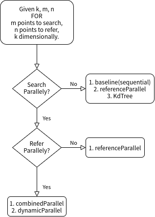
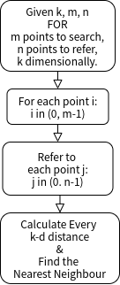
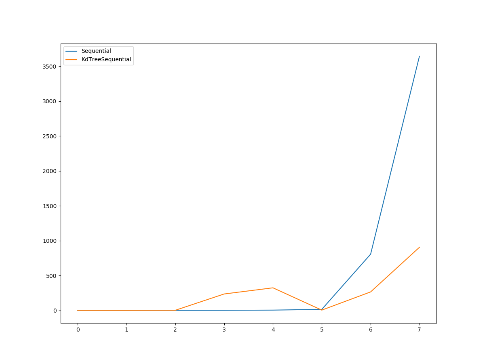
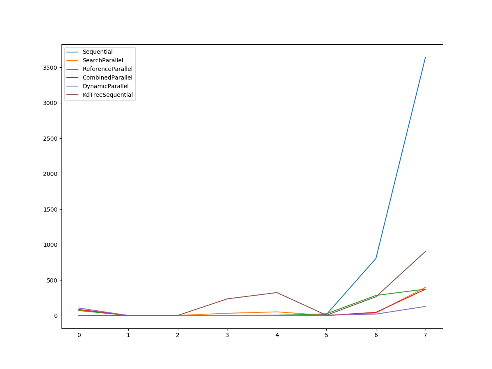
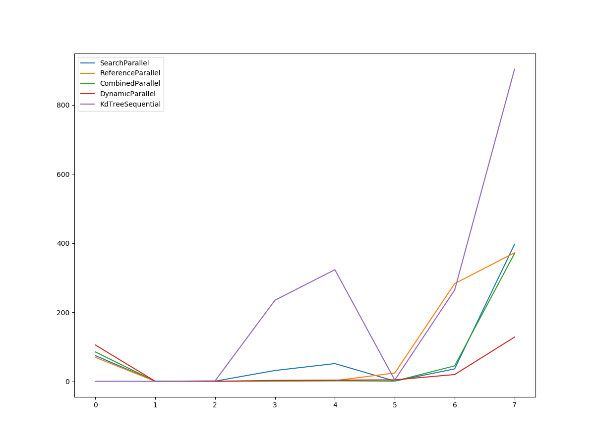

## Report - CUDA: K-d Nearest Neighbour Calculation (HW2)

> 17341137 - 宋震鹏 HW2

[toc]

<div STYLE="page-break-after: always;"></div>

### 1 Abstract

This report is mainly made of following sections:

* Experiment environment
* Overall logic
* Questions shooting
* Improve Performance & Comparison

---


### 2 Environment

#### 2.1 System info

| OS       | **Ubuntu 18.04.4 LTS**                        |
| -------- | --------------------------------------------- |
| **CPU**  | **Intel(R) Core(TM) i7-7700HQ CPU @ 2.80GHz** |
| **GPU**  | **GeForce GTX 1050**                          |
| **CUDA** | **CUDA Version 11.0.207**                     |

#### 2.2 DevTools

* Vscode + cmake + make
* gcc/g++ 4.8 / 7
* cmake 3.10

---

 [Back To Top](##Report - CUDA: Entropy Calculation in 2-d Matrix (HW1))

<div STYLE="page-break-after: always;"></div>

### 3 Overall Logic

#### 3.1 FlowChart




<div STYLE="page-break-after: always;"></div>

In this report, I will introduce 6 different implementations to solve this NN question, which produce the same and accurate result of course.

The searching process can be described as follow:



| Name                 | Search Process |Reference  Process|
| -------------------- | ------------------------------------------------ | ------------------------------------------------ |
| baseline(sequential) | sequential           |sequential|
| searchParallel       | parallel |sequential|
| referenceParallel    | sequential |parallel|
| combineParallel      | Conditional parallel |Conditional parallel|
| dynamicParallel      | parallel |parallel|
| kdTree               | sequential |sequential|

In those parallel versions, what actually the cuda kernel does will be discussed later.

<div STYLE="page-break-after: always;"></div>

#### 3.2 Kernel

##### 3.2.1 searchParallel Kernel

This implementation divide m search points into `divup(m, 1024)` blocks.

```cpp
int block_size = divup(m, 1024);
kernel <<<block_size, 1024>>> (k, m, n, searchPoints_d, referencePoints_d, indices_d);
```

While each Kernel process the Refer Process sequentially:

```cpp
__global__ void kernel(int k, int m, int n, float* searchPoints,
                       float* referencePoints, int* indices)
{
    int minIndex;
    float minSquareSum, diff, squareSum;
    int tid = blockDim.x * blockIdx.x + threadIdx.x;
    if (tid < m) {
        minSquareSum = -1;
        // Iterate over all reference points
        for (int nInd = 0; nInd < n; nInd++) {
            squareSum = 0;
            for (int kInd = 0; kInd < k; kInd++) {
                diff = searchPoints[k * tid + kInd] - referencePoints[k * nInd + kInd];
                squareSum += (diff * diff);
            }
            if (minSquareSum < 0 || squareSum < minSquareSum) {
                minSquareSum = squareSum;
                minIndex = nInd;
            }
        }
        indices[tid] = minIndex;
    }
}
```

<div STYLE="page-break-after: always;"></div>

##### 3.2.2 referenceParallel Kernel

This implementation divide n search points into `divup(n, 1024)` blocks.

```cpp
int block_size = divup(n, 1024);
kernel <<< block_size, 1024>>> (k, n, sub_searchPoints_d, referencePoints_d, dist_d);
```

Each Kernel process the Refer Process upon the point assigned by its `tid`, which leads to a parallelism:

```cpp
__global__ void kernel(int k, int n, float* sub_searchPoints,
                       float* referencePoints, float* dist)
{
    float diff, squareSum;
    int tid = blockDim.x * blockIdx.x + threadIdx.x;
    if (tid < n) {
        squareSum = 0;
        for (int i = 0; i < k; i++) {
            diff = sub_searchPoints[i] - referencePoints[k * tid + i];
            squareSum += (diff * diff);
        }
        dist[tid] = squareSum;
    }
}
```

However, for question with many searchpoints, it may perform bad.


##### 3.2.3 dynamicParallel Kernel

>   Please aware that:
>
>   1.  Only support arch no less than "compute_35" and "sm_35"
>   2.  NVCC flag should be set correctly.
>
>   Sample CMakeLists.txt
>
>   ```cpp
>   cmake_minimum_required(VERSION 3.10)
>   
>   find_package(CUDA QUIET REQUIRED)
>   
>   file(GLOB SOURCES "*.h" "*.cpp" "*.cu")
>   
>   set(CUDA_SEPARABLE_COMPILATION TRUE)
>   list(APPEND CUDA_NVCC_FLAGS -arch=compute_61)
>   
>   cuda_add_executable(main ${SOURCES})
>   
>   target_link_libraries(main ${CUDA_cudadevrt_LIBRARY})
>   ```

This implementation enable dynamic parallel function of cuda, which allow device function to call another device function or itself, with this technique, we can both process `search` and `refer` parallelly.

<div STYLE="page-break-after: always;"></div>

**refer kernel**

```cpp
__global__ void kernel(int k, int n, int bias, float* searchPoints,
                        float* referencePoints, float* dist)
{
    float diff, squareSum;
    int tid = blockDim.x * blockIdx.x + threadIdx.x;
    if (tid < n) {
        squareSum = 0;
        for (int i = 0; i < k; i++) {
            diff = searchPoints[k * bias + i] - referencePoints[k * tid + i];
            squareSum += (diff * diff);
        }
        dist[bias * n + tid] = squareSum;
    }
}
```

**search kernel**

```cpp
__global__ void over_kernel(int k, int m, int n, int block_size,
                            float* searchPoints, float* referencePoints,
                            float* dist_d, int* res)
{

    int tid = blockDim.x * blockIdx.x + threadIdx.x;
    if (tid < m) {
        int minIndex;
        float minSquareSum;

        kernel<<<block_size, 1024>>>(k, n, tid, searchPoints, referencePoints, dist_d);
        
        cudaDeviceSynchronize();
        
        minSquareSum = -1;
        for (int j = 0; j < n; j++) {
            if (minSquareSum < 0 || minSquareSum > dist_d[tid * n + j]) {
                minSquareSum = dist_d[tid * n + j];
                minIndex = j;
            }
        }
        res[tid] = minIndex;
    }
}
```

##### 3.2.4 combineParallel

This implementation automatically help the program choose to use searchParallel or referParallel, according to the scale of the testcase.

Btw, this implementation is an alternative for those devices with lower gpu-architecture.

<div STYLE="page-break-after: always;"></div>

#### 3.3 KdTree

KdTree is commonly known to be a effective `spatial partitioning data structures`, to lower the time cost as well as to accelerate the query.

Details of KdTree is skipped here.

##### 3.3.1 buildKdTree

```pseudocode
struct Node {
    float* location;
    int axis;
    int index;
    Node* left;
    Node* right;
    Node() {}
};

Node* buildKdTree(int k, int n, sample* referencePoints, int depth)
{
    Return NULL if n is 0
    
    // axis is regularly cycle from 0~k-1
    axis := depth % k;
    
    for each reference point:
        set axis
        set value at the axis
    end for

    sort reference points according to there values at selected axis.
    
    Init a new node.

    for each reference point:
        if i < median:
            Add point i to left subtree of node.
        end if
        if i > median:
            Add point i to right subtree of node.
        end if
    end for

    Free memory.
    
    // recurse and build
    node->left = buildKdTree(k, left_size, left_refer, depth + 1);
    node->right = buildKdTree(k, right_size, right_refer, depth + 1);

    Return node.
}
```

<div STYLE="page-break-after: always;"></div>

##### 3.3.2 kdTreeFindNearest

```cpp
void kdTreeFindNearest(Node* root, int k, int n, int search_bias, float* visited,
                       float* searchPoints, float* min_dist, Node** nearest, int* nearest_index)
{
    int pos = -1, axis;
    float minDist, dist, diff;
    Node** search_path = (Node**)malloc(sizeof(Node*) * n);
    float* sub_search = searchPoints + search_bias;

    Node* ptr = root;
    while (ptr) {
        search_path[++pos] = ptr;
        if (sub_search[ptr->axis] <= ptr->location[ptr->axis]) {
            ptr = ptr->left;
        }
        else {
            ptr = ptr->right;
        }
    }

    *nearest = search_path[pos];

    if (!visited[root->index]) {
        dist = 0;
        for (int i = 0; i < k; i++) {
            diff = sub_search[i] - (*nearest)->location[i];
            dist += (diff * diff);
        }
        visited[root->index] = dist;
        minDist = dist;
    }
    else {
        minDist = visited[root->index];
    }


    while (pos >= 0) {
        ptr = search_path[pos--];
        axis = ptr->axis;

        if (!ptr->left && !ptr->right) {

            if (!visited[root->index]) {
                dist = 0;
                for (int i = 0; i < k; i++) {
                    diff = sub_search[i] - (*nearest)->location[i];
                    dist += (diff * diff);
                }
                visited[root->index] = dist;
            }
            else {
                dist = visited[root->index];
            }
            if (minDist > dist) {
                minDist = dist;
                *nearest = ptr;
            }

        }
        else if (fabs(ptr->location[axis] - sub_search[axis]) < sqrt(minDist)) {

            if (!visited[root->index]) {
                dist = 0;
                for (int i = 0; i < k; i++) {
                    diff = sub_search[i] - (*nearest)->location[i];
                    dist += (diff * diff);
                }
                visited[root->index] = dist;
            }
            else {
                dist = visited[root->index];
            }
            if (minDist > dist) {
                minDist = dist;
                *nearest = ptr;
            }

            if (sub_search[axis] <= ptr->location[axis]) {
                if (ptr->right) {
                    float new_dist = 0;
                    Node** new_nearest = (Node**)malloc(sizeof(Node*));
                    kdTreeFindNearest(ptr->right, k, n, \
                                      search_bias, visited, searchPoints,\
                                      &new_dist, new_nearest, nearest_index);
                    if (minDist > new_dist) {
                        minDist = new_dist;
                        *nearest = *new_nearest;
                    }
                    free(new_nearest);
                }
            }
            else {
                if (ptr->left) {
                    float new_dist = 0;
                    Node** new_nearest = (Node**)malloc(sizeof(Node*));
                    kdTreeFindNearest(ptr->left, k, n, \
                                      search_bias,visited, searchPoints,\
                                      &new_dist, new_nearest, nearest_index);
                    if (minDist > new_dist) {
                        minDist = new_dist;
                        *nearest = *new_nearest;
                    }
                    free(new_nearest);
                }
            }

        }
    }
    *min_dist = minDist;
    *nearest_index = (*nearest)->index;
    free(search_path);

```

What kdTree actually does is to help lower the time complexity from $O(n^2)$ to $O(n^{{\frac{k-1}{k}}}+m)$.

However, this method performed bad since I may not perfectly implement it. It'll be fixed in the future.


#### 3.4 CMakeLists.txt

**For Dynamic Parallel**

```cmake
cmake_minimum_required(VERSION 3.10)

find_package(CUDA QUIET REQUIRED)

file(GLOB SOURCES "*.h" "*.cpp" "*.cu")

cuda_add_executable(main ${SOURCES})
```

**For other methods**

```cmake
cmake_minimum_required(VERSION 3.10)

find_package(CUDA QUIET REQUIRED)

# Online Compile
# file(GLOB SOURCES "src/*.h" "src/*.cpp" "src/*.cu")

# Local Compile
file(GLOB SOURCES "*.h" "*.cpp" "*.cu")

set(CUDA_SEPARABLE_COMPILATION TRUE)
list(APPEND CUDA_NVCC_FLAGS -arch=compute_61)

cuda_add_executable(main ${SOURCES})

target_link_libraries(main ${CUDA_cudadevrt_LIBRARY})
```

```bash
$ cmake ./ && make clean && make && mv ./main ../bin/main && ../bin/main
```

Note: Make sure to run the shell code in `src/`.

**Compile Message**

```bash
# karl @ karl in ~/Coding/Cuda-Programming/Experiments/Exp05-k-dClosestPoints/baseline(sequential)/src [14:45:39] 
$ cudamake
-- The C compiler identification is GNU 4.8.5
-- The CXX compiler identification is GNU 4.8.5
-- Check for working C compiler: /usr/bin/gcc-4.8
-- Check for working C compiler: /usr/bin/gcc-4.8 -- works
-- Detecting C compiler ABI info
-- Detecting C compiler ABI info - done
-- Detecting C compile features
-- Detecting C compile features - done
-- Check for working CXX compiler: /usr/bin/g++-4.8
-- Check for working CXX compiler: /usr/bin/g++-4.8 -- works
-- Detecting CXX compiler ABI info
-- Detecting CXX compiler ABI info - done
-- Detecting CXX compile features
-- Detecting CXX compile features - done
-- Looking for pthread.h
-- Looking for pthread.h - found
-- Looking for pthread_create
-- Looking for pthread_create - not found
-- Looking for pthread_create in pthreads
-- Looking for pthread_create in pthreads - not found
-- Looking for pthread_create in pthread
-- Looking for pthread_create in pthread - found
-- Found Threads: TRUE  
-- Configuring done
-- Generating done
-- Build files have been written to: /home/karl/Coding/Cuda-Programming/Experiments/Exp05-k-dClosestPoints/baseline(sequential)/build
[ 33%] Building NVCC (Device) object CMakeFiles/main.dir/main_generated_main.cu.o
[ 66%] Building NVCC (Device) object CMakeFiles/main.dir/main_generated_core.cu.o
Scanning dependencies of target main
[100%] Linking CXX executable main
[100%] Built target main
```

#### 3.5 File Tree

```shell
.
├── doc
├── baseline(sequential)
├── combinedParallel
├── dynamicParallel
├── KdTree
├── referenceParallel
└── searchParallel

---

./{DIR}
├── bin
├── build
└── src
```

* **bin** : stores the excutable binary file
* **build** : stores cmakefiles and makefile
* **src** : stores the source code 
  * *.h: header files
  * core.cu: cuda kernel file
  * main.cu: main file
  * results.csv: result in csv format

---

 [Back To Top](##Report - CUDA: K-d Nearest Neighbour Calculation (HW2))

<div STYLE="page-break-after: always;"></div>

### 4 Questions shooting

 1. <u>介绍程序整体逻辑，包含的函数，每个函数完成的内容。（10分）</u>

    * <u>对于核函数，应该说明每个线程块及每个线程所分配的任务</u>

    **问题主要已在[3 Overall Logic](#3 Overall Logic)进行说明。**

    **核函数：**

    **核函数有以下几种：**

    1.  **tid对应要进行搜索的查询点编号：核函数串行对所有参考点进行搜索。**
    2.  **tid对应要进行参考的参考点编号：核函数只负责计算当前搜索点到tid对应的参考点距离。**
    3.  **外层核函数tid对应要进行搜索的查询点编号，内层tid对应要进行参考的参考点编号：动态并行，此时会进行两次并行分配，但核函数的功能实际上与之前没有太大出入。**

    

 2.  <u>解释程序中涉及哪些类型的存储器（如，全局内存，共享内存，等），并通过分析数据的访存模式及该存储器的特性说明为何使用该种存储器。（15分）</u>

    **涉及全局内存、局部内存（函数调用栈中）**

    **首先，对于所使用的全局内存：**

    1. **传入的搜索点、参考点集都是全局内存。**
    2. **用于保存结果的indices数组是全局内存。**

    **对于所使用的局部内存：**

    1. **函数内的各个局部变量，这些变量只为其所在函数空间提供帮助、不会影响其他空间、不与其他函数、代码段产生依赖，因此，可以使用函数调用结束后就自动销毁的局部内存。**

    

 3. <u>针对查询点集为1个点及1024个点给出两个版本，并说明设计逻辑（例如，任务分配方式）的异同。如两个版本使用同一逻辑，需说明原因。（35分）</u>

     ​	**在子实验`combinedParallel`中，对于查询点集为1个点的情况，对参考点集进行并行搜索；而对1024个点的情况，对查找点集进行并行化处理，而串行对参考点集进行搜索。**

     ​	**不考虑线程之间通信（本次实验实际上也不涉及通信），两种版本耗时实际上是容易分析的：**

     **对k维的问题，以及m个查询点、n个参考点：**
     $$
     T1 = [m/1024]\times n \times k\\
     T2 = m \times [n/1024]\times k\\
     $$

     <div STYLE="page-break-after: always;"></div>

 4. <u>请给出一个基础版本（baseline）及至少一个优化版本。并分析说明每种优化对性能的影响。（40分）</u>

     * <u>具体得分根据优化难度（技巧及工作量）而定。</u>

     **通过Scaffold-hw2-v2的Check**

     ```bash
     on running CALLBACK1...
     Callback1,  3,    1,     2,      0.000ms
Callback1,  3,    2,     8,      0.000ms
     Callback1,  3,    1,  1024,      0.013ms
Callback1,  3,    1, 65536,      0.763ms
     Callback1, 16,    1, 65536,      3.824ms
Callback1,  3, 1024,  1024,     14.082ms
     Callback1,  3, 1024, 65536,    872.356ms
     Callback1, 16, 1024, 65536,   4036.489ms
     
on running CALLBACK2...
     Callback2,  3,    1,     2,     82.381ms
errors/total w.r.t. baseline: 0/1
     
Callback2,  3,    2,     8,      0.239ms
     errors/total w.r.t. baseline: 0/2
     
     Callback2,  3,    1,  1024,      0.705ms
errors/total w.r.t. baseline: 0/1
     
Callback2,  3,    1, 65536,     39.335ms
     errors/total w.r.t. baseline: 0/1

     Callback2, 16,    1, 65536,     65.150ms
     errors/total w.r.t. baseline: 0/1
     
Callback2,  3, 1024,  1024,      1.155ms
     errors/total w.r.t. baseline: 0/1024

     Callback2,  3, 1024, 65536,     44.794ms
errors/total w.r.t. baseline: 0/1024
     
     Callback2, 16, 1024, 65536,    384.491ms
     errors/total w.r.t. baseline: 0/1024

     
on running CALLBACK3...
     Callback3,  3,    1,     2,      0.201ms
errors/total w.r.t. baseline: 0/1
     
     Callback3,  3,    2,     8,      0.197ms
     errors/total w.r.t. baseline: 0/2

     Callback3,  3,    1,  1024,      0.159ms
errors/total w.r.t. baseline: 0/1
     
Callback3,  3,    1, 65536,      0.558ms
     errors/total w.r.t. baseline: 0/1

     Callback3, 16,    1, 65536,      1.595ms
errors/total w.r.t. baseline: 0/1
     
     Callback3,  3, 1024,  1024,     17.928ms
     errors/total w.r.t. baseline: 0/1024
     
     Callback3,  3, 1024, 65536,    242.376ms
     errors/total w.r.t. baseline: 0/1024
     
     Callback3, 16, 1024, 65536,    336.127ms
     errors/total w.r.t. baseline: 0/1024
     
     
     on running CALLBACK4...
     Callback4,  3,    1,     2,      0.212ms
     errors/total w.r.t. baseline: 0/1
     
     Callback4,  3,    2,     8,      0.221ms
     errors/total w.r.t. baseline: 0/2
     
     Callback4,  3,    1,  1024,      0.167ms
     errors/total w.r.t. baseline: 0/1
     
     Callback4,  3,    1, 65536,      0.682ms
     errors/total w.r.t. baseline: 0/1
     
     Callback4, 16,    1, 65536,      1.440ms
     errors/total w.r.t. baseline: 0/1
     
     Callback4,  3, 1024,  1024,      0.698ms
     errors/total w.r.t. baseline: 0/1024
     
     Callback4,  3, 1024, 65536,     34.695ms
     errors/total w.r.t. baseline: 0/1024
     
     Callback4, 16, 1024, 65536,    361.320ms
     errors/total w.r.t. baseline: 0/1024
     
     
     on running CALLBACK5...
     Callback5,  3,    1,     2,      0.316ms
     errors/total w.r.t. baseline: 0/1
     
     Callback5,  3,    2,     8,      0.278ms
     errors/total w.r.t. baseline: 0/2
     
     Callback5,  3,    1,  1024,      0.338ms
     errors/total w.r.t. baseline: 0/1
     
     Callback5,  3,    1, 65536,      2.540ms
     errors/total w.r.t. baseline: 0/1
     
     Callback5, 16,    1, 65536,      3.319ms
     errors/total w.r.t. baseline: 0/1
     
     Callback5,  3, 1024,  1024,      4.783ms
     errors/total w.r.t. baseline: 0/1024
     
     Callback5,  3, 1024, 65536,     68.510ms
     errors/total w.r.t. baseline: 0/1024
     
     Callback5, 16, 1024, 65536,    160.727ms
     errors/total w.r.t. baseline: 0/1024
     ```
     
     <div style="page-break-after: always;"></div>
     
     **无优化：串行实验**
     
     |    sample    |   1   |   2   |   3   |   4   |   5   |   6    |    7    |   8    |
     | :----------: | :---: | :---: | :---: | :---: | :---: | :----: | :-----: | :----: |
     | **time**(ms) | 0.000 | 0.001 | 0.013 | 0.818 | 3.737 | 14.214 | 805.130 | 3643.3 |
     
     **对于该串行版本的优化策略已在上文介绍，此处进行实验数据的展示、对比。**
     
     **查找点集并行化**
     
     |    sample    |   1   |   2   |   3   |   4    |   5    |   6   |   7   |    8    |
     | :----------: | :---: | :---: | :---: | :----: | :----: | :---: | :---: | :-----: |
     | **time**(ms) | 74.53 | 0.166 | 0.589 | 31.381 | 51.396 | 0.749 | 36.11 | 396.905 |
     
     **查找点数量 >> 参考点数量时表现较好，反之性能将不升反降。**
     
     **参考点集并行化**
     
     |    sample    |   1    |   2   |   3   |   4   |   5   |   6    |   7    |   8    |
     | :----------: | :----: | :---: | :---: | :---: | :---: | :----: | :----: | :----: |
     | **time**(ms) | 69.444 | 0.185 | 0.166 | 0.859 | 2.039 | 24.153 | 282.93 | 372.26 |
     
     **参考点数量 >> 查找点数量时表现较好，反之性能将不升反降。**
     
     **混合并行化**
     
     |    sample    |   1   |   2   |   3   |   4   |   5   |   6   |   7    |    8    |
     | :----------: | :---: | :---: | :---: | :---: | :---: | :---: | :----: | :-----: |
     | **time**(ms) | 85.06 | 0.234 | 0.202 | 0.905 | 1.501 | 0.729 | 44.789 | 370.451 |
     
     **对于测试样例中的不同情况选择`查找点集并行化`或`参考点集并行化`。**
     
     **动态并行化**
     
     |    sample    |    1    |   2   |  3   |   4   |   5   |   6   |   7    |    8    |
     | :----------: | :-----: | :---: | :--: | :---: | :---: | :---: | :----: | :-----: |
     | **time**(ms) | 105.276 | 0.234 | 0.23 | 2.713 | 3.515 | 4.339 | 19.648 | 128.083 |
     
     **在参考点数量以及查找点数量都很较多时表现较好，反之性能由于创建线程的开销等不升反降。**
     
     **kd树（串行）**
     
     |    sample    |   1   |   2   |  3   |    4    |    5    |   6   |   7   |    8    |
     | :----------: | :---: | :---: | :--: | :-----: | :-----: | :---: | :---: | :-----: |
     | **time**(ms) | 0.004 | 0.007 | 1.5  | 235.028 | 323.271 | 3.809 | 264.5 | 903.987 |
     
     **与并行算法相比效率有所下降，但较朴素串行算法性能提高很多。**
     
     
     
     **Comparison**
     
     
     
     

**分析以上数据，可以看到：**

1. **kdTree能显著降低串行算法的时间开销、同时确保结果的正确性。**
2. **并行算法中，由于线程创建开销，在规模极小的情况下性能不如串行算法。**
3. **在部分数据规模大（只有参考点多或只有查找点多）时，针对大规模部分进行并行化收效显著。**
4. **在全部数据规模较大的情况下，需要计算能力2.0以上支持的动态并行算法有着最好的表现。**

---

 [Back To Top](##Report - CUDA: K-d Nearest Neighbour Calculation (HW2))

---


### 5 Words in the end

Each implementation was separately store in the directory of its name, please refer to it for detailed message.

The correctness is guaranteed by `diff` against the result.csv file generated originally in the scaffold.

(If there're no difference, `diff` give an empty output.)

---

17341137 宋震鹏  [Back To Top](##Report - CUDA: K-d Nearest Neighbour Calculation (HW2))

